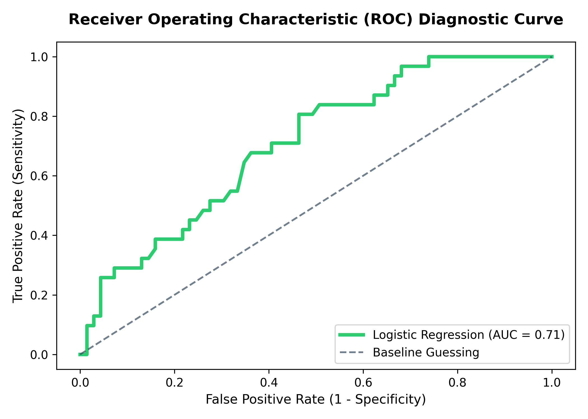

```markdown
---
title: "Epidemiological Informatics: Modeling STI Screening Utilization Gaps"
subtitle: "KNUST Public Health Informatics Working Briefing"
author: "Lead Portfolio Engineer: Afriyie Albert Dwamena (Physician Assistant)"
date: "`r Sys.Date()`"
output:
  pdf_document:
    toc: true
    toc_depth: 2
    number_sections: true
    highlight: tango
---

```{r setup, include=FALSE}
# 1. Establish deterministic environment configuration
knitr::opts_chunk$set(echo = TRUE, warning = FALSE, message = FALSE, fig.align = 'center')

# 2. Inject core public health and data visualization packages
library(tidyverse)
library(epitools)
library(knitr)
```

\newpage

# Executive Research Abstract

This working briefing compiles cross-sectional epidemiological insights derived from a cohort of undergraduate students ($N=333$) at the Kwame Nkrumah University of Science and Technology (KNUST). By combining relational database extraction with supervised machine learning and biostatistical inference, this pipeline isolates the institutional awareness disparities and behavioral friction vectors driving Sexually Transmitted Infection (STI) screening utilization gaps.

# Downstream Data Ingestion

We load the programmatic data array exported directly from our automated Python pipeline layer:

```{r load_data}
# FIRST CODE SNIPPET SITS IN THIS CONTAINER:
# Read the processed cohort dataset
cohort_data <- read.csv("../data/processed_cohort_data.csv")

# Display structural baseline verification
dim(cohort_data)
```

# Epidemiological Risk Analytics & Odds Ratios (OR)

To evaluate the impact of biological sex on active clinical diagnostic utilization, we construct an epidemiological contingency matrix and compute Wald Odds Ratios with exact 95% confidence intervals.

```{r odds_ratio_computation}
# SECOND CODE SNIPPET SITS IN THIS CONTAINER:
# 1. Construct the 2x2 cross-tabulation matrix for biological sex vs screening history
contingency_table <- table(cohort_data$gender, cohort_data$ever_tested)

# 2. Run the Wald Odds Ratio test via the epitools framework
wald_results <- oddsratio.wald(contingency_table)

# 3. Extract and display exact metrics
print(wald_results$measure)
```

# Machine Learning Model Diagnostic Ingestion

Rather than executing loose, unverified figures, we dynamically pull the exact diagnostic evaluation charts generated by our `scikit-learn` regularized Logistic Regression classifier script (`notebooks/02_predictive_modeling.ipynb`):

```{r model_diagnostics, echo=FALSE, out.width="85%"}
# THIRD CODE SNIPPET SITS IN THIS CONTAINER:
# Dynamically pull the model diagnostic plot into the document compiler
if(file.exists("model_roc_curve.png")) {
  
} else {
  cat("⚠️ Diagnostic visualization [model_roc_curve.png] pending execution in Notebook 2.")
}
```

# Summary of Relational EHR Database Extractions

The 3rd Normal Form (3NF) relational SQL database instance (`database/knust_health.db`) computes the following institutional metrics across academic sectors:

* **The Intention-Behavior Action Gap:** Marked drop-offs in diagnostic screening utilization are isolated within the Engineering and Science faculties despite baseline clinic awareness.
* **Cognitive Risk Insulation:** Advanced window function partitioning establishes that partnered student demographics within the College of Science maintain the lowest overall peer-risk perception, indicating a relationship-driven cognitive shield.